# 
 100 Things I Wish I'd Known in My First 10 Days in Vancouver

<big><b> Unofficial UBC Sauder Newcomer Tips</b></big>

Henry Wu

<i>Current Version: v1.0 | Updated: 2023-08-10 | Link of Latest Version: https://github.com/ihenrywu/100things</i>

## 

If you're stepping into Sauder, UBC, or Vancouver for the first time, it's natural to feel jittery. Hey, I was in your shoes once! Coming to Sauder marked my first time in Vancouver too. And, looking back, having a cheat sheet of sorts would've certainly eased my nerves. Hence, that is the origin of this note. Oh, and while the title promises 100 things, we aren't there yet. But we're on our way! It is an iterative process. 

If any introduction is not detailed enough, or if any topic you think is important not included, feel free to touch me. Let's make 100 things together.

> **Disclaimer：** This guide stems from personal experiences and some materials are from the Internet, they  might have a few misses. So, cross-check with credible sources before making major decisions. If you spot any errors or has any question, drop me a mail at [ihenrywu.ca#gmail.com](mailto:ihenrywu.ca#gmail.com) or contact me on [LinkedIn](https://www.linkedin.com/in/ihenrywu/).

## ► First Things First

### • Study Permit

The Study Permit is almost the most important document during your studies in Canada, it legitimizes your stay in this country. Don't confuse it with your student visa, which is affixed to your passport and lets you into Canada. The Study Permit is an A4-sized document you obtain when entering the country.

>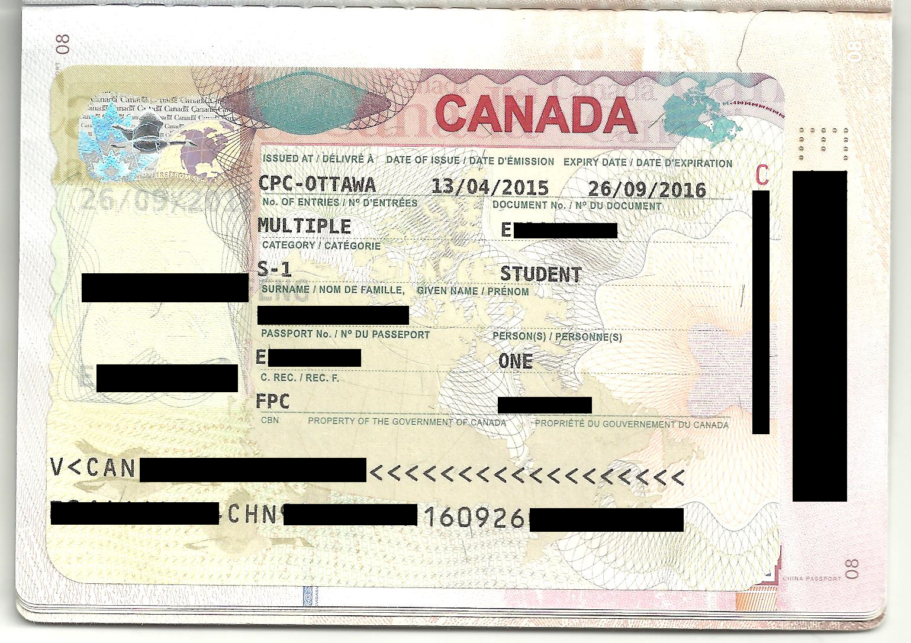
>[Student Visa on passport (source)](https://en.wikipedia.org/wiki/Visa_policy_of_Canada#/media/File:Student_Visa_of_Canada_Issued_on_the_PRC_Passport_in_2015.jpg)

>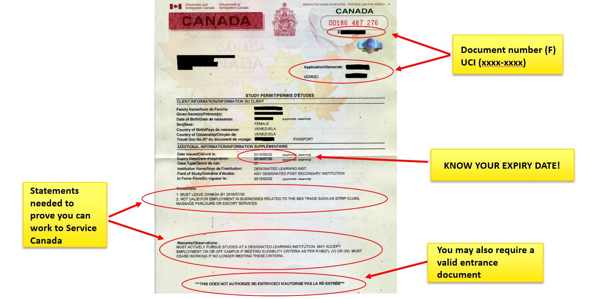
>[Study Permit (source)](https://www.ucalgary.ca/live-uc-ucalgary-site/sites/default/files/teams/69/study-permit-with-info.jpg)

When you get your student visa, you are eligible for Study Permit. What you need to do is to pick up the A4 size paper when you arrive in Canada, for most people, the Vancouver airport. The document you need to prepare is "letter of introduction" you received from IRCC when they issued your visa.

The place you get the Study Permit is the Immigration office adjacent to the No.23 baggage claim carousel in the airport after you pass customs. There are several rows of chairs in that hall, so go in and sit down in order, and a staff member will come by to collect the documents. After that, wait for the staff to call your name at the counter. 

>
>[Immigration office at YVR](https://offtracktravel.ca/arriving-vancouver-working-holiday-iec/)

You need to pay attention to the various possible pronunciations of your name in English. Don't expect too much from the staff's foreign language pronunciation. It often happens that some people are called several times before realizing that they are being called.

After you get your Study Permit, make sure that your name and the length of time you are allowed to stay are correct, and then you can go pick up your luggage. Considering that getting the Study Permit takes about half an hour, many people will choose to get their luggage first and put it in a corner somewhere before waiting for the Study Permit. Don’t walk through the gate of the exit without getting your Study Permit since it is a one-way gate.

>**Link**: [Documents you need when you arrive in Canada](https://www.canada.ca/en/immigration-refugees-citizenship/services/study-canada/study-permit/prepare-arrival.html)

>**PDF**: [Information for international students](https://www.cbsa-asfc.gc.ca/publications/pub/international-students-etudiants-etrangers-eng.pdf)

### • Work Permit

The Study Permit allows you to study in Canada, but does not authorize you to work in Canada, including part-time jobs and internships, which require a Work Permit, also a A4-size paper. Because Sauder's MBA and MBAN programs have internships in their requirements, you must also apply for a Work Permit. Some people apply for Work Permit when they apply for their visitor visa as well, then they can get both Study Permit and Work Permit when they enter the country; some others submit study purposes only when they apply for the visa, then please apply for Work Permit online after entering the country.

Most of us need a visa to enter Canada, so I'm sure you already know about the IRCC's efficiency. But rest assured, IRCC can still surprise you when applying for a Work Permit. I applied online in August but didn't receive it until January. Our internship started in April though, so it was not too late. Anyway, apply as early as you can. If you don't have a Work Permit, you might not be eligible for the internship, then you won't get the corresponding credits, which may affect your graduation.

### • MSP

After settling, apply for MSP (Medical Services Plan) as soon as possible. MSP is an insurance policy which costs $75 per month and will prevent you from going bankrupt due to illness. You need to wait 3 months for this card to take effect. The school will have iMed plan for each student as a transition insurance during this 3 month period. So you must apply for MSP in time to avoid gaps.

>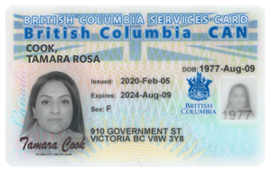
>[MSP card (source)](https://www2.gov.bc.ca/gov/content/governments/government-id/bc-services-card)

Believe me, paying for your own hospitalization must be one of the last things you want to do in Canada. A while ago, I had some tooth fillings in Vancouver. The good news is that MSP covered some of the costs, but even so, the moment I saw the bill, how can I put it, I don't think MBA tuition is that expensive anymore.

>**Link:** [MSP application website](https://www2.gov.bc.ca/gov/content/health/health-drug-coverage/msp)
 
## ► Baggage

If you're not in Canada when you read this, you still have a chance to double-check your luggage. Technically, if you have enough budget, you only need a credit card for carry-on luggage: you can buy anything in Vancouver. But if you want to save money, it's better to use your full airline baggage allowance. Some pointers:
 
### • Suits

Business students, spoiler alert: there are a few occasions during your studies where the dress code is formal. So, if you have a suit, pack it.
 
### • Bed sheets

As ridiculous as it sounds, you may not believe me when I say it, but when you rent an apartment in Vancouver, the odds are high that the room has no furniture. Yes, your rent does not include a bed, couch, table and chairs in the room. This means that for your first night in Vancouver, you will either stay in a hotel, an Airbnb, or sleep on the floor. 
 
Considering that hotel prices always peak at the beginning of the school year, it's better to sleep on the floor if you don't particularly mind. A bed sheet will make you feel not that bad. The rooms usually have carpeting, so put on sheets and sleep for a few days until your bed from IKEA arrives.
 
### • Prohibited goods
 
Please read the list of "Restricted and prohibited goods" published by the Canadian Border Services Agency carefully. Generally speaking, fruits and meats are prohibited. Just because Canada is a friendly country doesn't mean fines aren't here. Don't let a ticket be the first impression you leave when you enter Canada.
 
>**Link:** [Restricted and prohibited goods](https://www.cbsa-asfc.gc.ca/travel-voyage/rpg-mrp-eng.html)
 
## ► Phone Cards

If necessary, activate your homeland SIM card for international roaming, or at least to ensure that you can receive text messages. This is so that you can, for one, receive a verification code when you sign up for an account before you buy a Canada SIM card, and in case some accounts in your home country require verification by text message.

>

>[Canada wireless providers (source)](https://www.cbc.ca/news/business/marketplace-high-cell-phone-bills-1.6711205)
 
While many SIM card options exist in Canada, the main carriers are Rogers, Bell, and TELUS. Affordable choices for international students include Fido, Koodo, and Lucky, which around $30-40 per month. The cheapest phone card is Public Mobile, which costs $10-15 a month but has the least airtime and traffic. Take some time to do your homework in advance, pick the best one for you, and then go to the nearest store to buy a SIM card when you arrive in Canada.
 
## ► Bank Cards

Top banks include RBC, CIBC, TD, BMO, and Scotiabank. They often have promotions on card openings, so research well on their websites first. With your passport and Study Permit, you can apply for a debit card, and it is best to apply for a credit card at the same time to build up your credit score in Canada.

>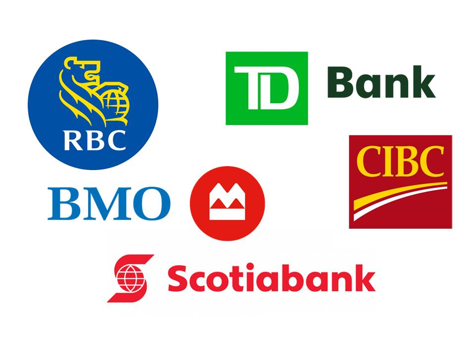
>[Top 5 Banks in Canada](https://fintel.io/news/latest-results-suggest-best-days-behind-canadian-banks-749)
 
All of these banks have branches on campus. But note that most banks do not accept walk-in to open an account, so you must make an appointment on the official website. You can do it now, based on your arrival date, so you can be the first to get a card once you've settled in. If you already have a Visa or Mastercard card from your home country, you can swipe it in most cases. In addition, for Chinese students, Alipay is accepted in many places in Vancouver.
 
## ► Shopping

### • Supermarkets

Vancouver has many chain supermarkets that can satisfy your daily needs, such as Save on Foods, Safeway, Walmart, No-frills, Costco, etc. If you are looking for furniture, there are IKEA, SleepCountry, etc.
 
### • Online shopping

The most mainstream online shopping in Vancouver is still Amazon, the fastest can be the same day delivery, usually one to two days. In addition, many supermarkets mentioned above also have their own online shopping channels, and you can place an order through their Apps.
 
In terms of price, the cheapest is Temu, which has just started operating in Canada this year. but the disadvantages are, first, from ordering to receiving the goods, it takes about one to two weeks. Secondly, considering the price, it is recommended not to have too high expectations for the quality of the product.
 
### • One-Dollar store

Vancouver has many one-dollar stores, which can be understood as the offline version of Temu, almost the cheapest place to buy things offline. One on campus is named Dollar 'N' Plus, near McDonald's.
 
Location: 5721 Dalhousie Rd, Vancouver, BC V6T 2H9
 
### • Second-hand
Buying second-hand is a good option if you want to get good quality stuff for less money, and it's also more environmentally friendly. "Don't lose it, reuse it". Facebook's Market is the mainstream online trading platform for second-hand, but be aware of scams. Remember “no goods no pay”.
 
In addition, you can join some Facebook groups, such as "UBC Buy and Sell Items," "Buy Nothing UBC Campus, Vancouver BC". The latter is a group where kindhearted UBCer gives away free second-hand, so as long as you're quick with your hands, you can save much money.

>Link: [Facebook Group: UBC Buy and Sell Items](https://m.facebook.com/groups/ubcbuyandsellitems/?ref=share&mibextid=K8Wfd2)

>Link: [Facebook Group: Buy Nothing UBC Campus](https://m.facebook.com/groups/bnpubc/?ref=share&mibextid=K8Wfd2)
 
## ► Getting Around

### • Public Transportation

Public Transportation: Vancouver, like many cities, offers an eco-friendly and budget-friendly mode of transportation: public transit. In addition to biking, the city's rail transit, the SkyTrain, is both punctual and efficient. One downside: UBC isn't on its current route. The good news is that UBC is on the plan of the SkyTrain route, while the bad news is that UBC students have heard this news for at least a decade.
 
 
### • UPASS

At UBC, there's a bus loop serving as the terminus for several buses. Attention! As part of the UBC student benefits, the UPASS allows you to ride the bus/SkyTrain for FREE during your study period. To get it, purchase a Compass card and link it to your student account. You can buy one at the UBC bookstore or Shoppers on campus. 

>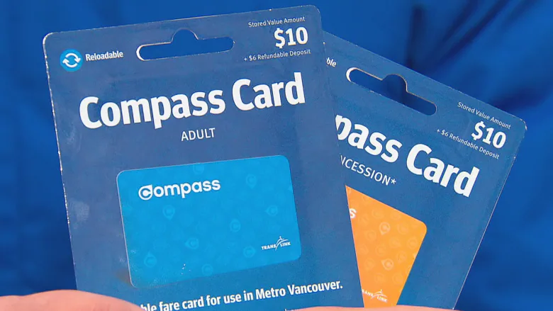
>[Compass Card](https://www.cbc.ca/news/canada/british-columbia/preloaded-compass-cards-faredealers-1.3412249)
 
Actually, this isn't truly "free" - it's part of your tuition. So, don’t waste it. By the way, you need to manually update your card on the UPASS website at the end of each month so that it will work the following month. On the first of every month, you can see some passengers on the bus, embarrassed to find out that the swipe card failed. To be safe, you can set an alarm each month.

>**Link:** [Compass Card website](https://www.compasscard.ca/)

>**Link:** [UPASS website](https://upassbc.translink.ca/)
 
One more thing, in Canada, at least in Vancouver, there is a special culture in public transportation: when you get off the bus, you need to say "thank you" loudly to the driver. I'm not kidding; it's true. Welcome to friendly Canada. But you don't have to say "thank you" to the driver on SkyTrain - after all, it's driverless.
 
### • Uber

Uber is a popular choice in Vancouver, with Lyft and Kabu also available. These apps are super convenient, but can be pricey.
 
### • Rent a car

Vancouver is also very convenient to rent a car. The most common car rental company is EVO, which costs about 20 dollars an hour. By the way, you can get a 25 dollar coupon if you register with my refer code: XDO7VX05. 

>
>[EVO](https://www.vulog.com/blog/the-eco-friendly-carsharing-service-in-vancouver-evo-vulog/)

There are also other choices, like modo, zerocar. To rent a car you need to have a local driver's license, or your home country's license plus an approved translation.
 
**Link:** [EVO website](https://evo.ca/)
 
##	▶ Identifications

### • Student card

You don't have to wait until you arrive in Canada to apply. Submit the necessary photo online, and in a few days, pick it up at select places on campus, like the UBC bookstore, when you arrive at UBC. With the student ID, you can enter Sauder's meeting rooms, check out books from the library, buy goods from the vending machines, and so on.

>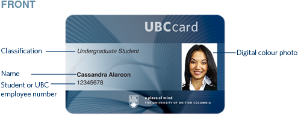
>[Student Card](https://ubccard.ubc.ca/about-the-ubccard)
 
>**Link:** [Apply for UBC student card](https://ubccard.ubc.ca/)
 
### • Student Email

This is just as important as the student ID card. Many student-related benefits on and off campus at UBC require identification through student email, so try to apply as early as possible. Also, you don't have to wait until you arrive in Canada to apply.
 
>**Link:** [Apply for UBC student email](https://it.ubc.ca/services/email-voice-internet/ubc-student-email-service)
 
### • BCID

If you don't plan on getting a local driver's license, this is the only photo ID you can get from the local government while you're studying, and you can lock up your passport once you have your BCID. Basically, all the places in BC that require government-issued identification, you show your BCID, and you're good to go.

>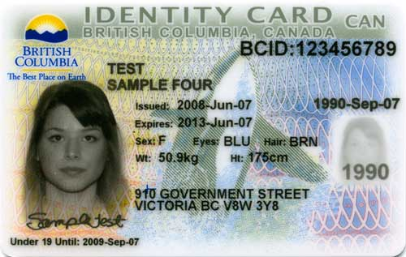
>[BCID](https://www.redsealnotary.com/Publications/2013-07-08-Help-no-ID-in-British-Columbia.php)

The place to apply is ICBC (Insurance Corporation of British Columbia), the office which also issues driver's license. Note that it's not the bank CIBC. 

>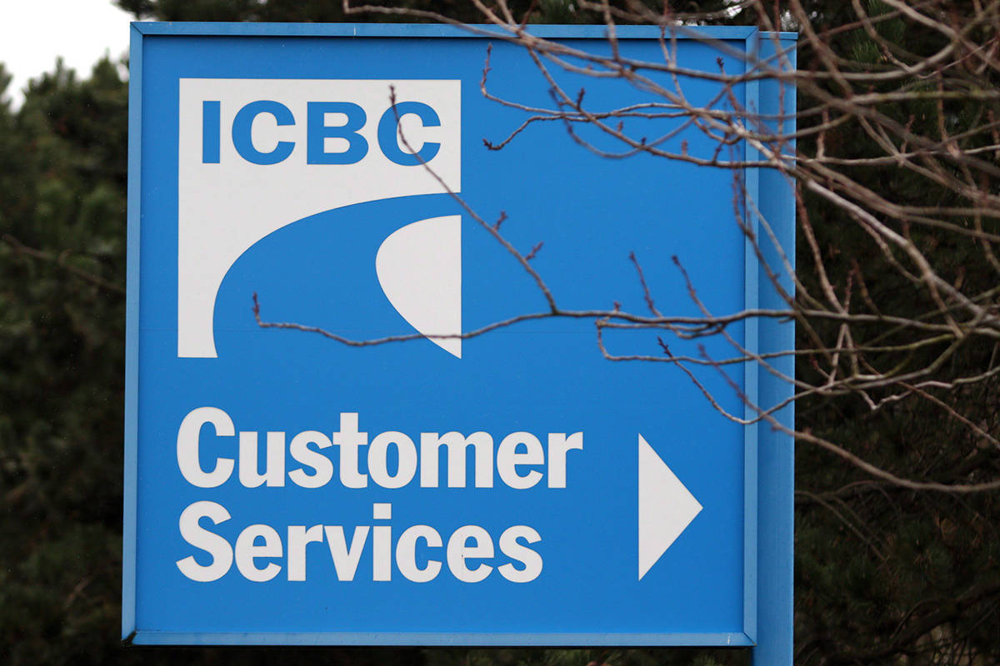
>[ICBC](https://www.surreynowleader.com/news/icbc-moves-to-appointment-based-system-for-all-in-office-driver-services/)
 
The application process is very simple, with your passport and Study Permit, go to the nearest office of ICBC and apply for it. The card will be sent to your mailbox in about 10 working days. Walk-in are accepted but usually required for a specific time slot, so it's best to make an appointment online in advance.
 
**Link:** [Apply for BCID](https://www.icbc.com/driver-licensing/getting-licensed/Pages/Apply-for-a-BCID.aspx)
 
### • Driver's License

You can apply for a local driver's license if you plan to rent or buy a car. If you already have a driver's license from some countries, such as the US, you can replace it directly through some paperwork, but if you hold a passport from some other countries, such as China, you need to take a new paper and road test. If you have a previous license and a certain number of years of driving experience, you do not have to start the test from scratch.
 
Note that if your previous driver's license is in a language other than English, you need to find a translation agency authorized by ICBC to translate it. The cost is about $10-$30.
 
### • SIN

Social Insurance Number is a unique identifier used by the Government of Canada to identify individuals and track their personal insurance, tax and employment records. A person has one and only one. Since our program includes an internship, you'd better apply for SIN. 

Note that this is not a card, but nine numbers. Although the staff does give you a piece of paper with this number on it once it has been processed, that piece of paper is just a normal A4 sheet of paper, it is the number that is important. Please keep this number confidential and do not post it on the Internet or tell anyone other than your employer about it, except when doing related business at a bank or other government organizations.
 
You can get your SIN at Service Canada Centers, which are many. You can search for the one closest to you on Google. The required documents are a passport, Study Permit, documents proving your address, and possibly proof of enrollment. SIN accepts walk in, but like BCID, making an appointment in advance is highly recommended before you go. Otherwise, you may wait until the site and wonder if the time has stopped.
 
>**Link:** [Apply for SIN](https://www.canada.ca/en/employment-social-development/services/sin/apply.html)
 
 
 
## ► Campus

UBC, often heralded as North America's most beautiful campus, offers breathtaking views  of ocean and snow-covered mountains. Here are some must-visit spots on campus:
 
### • Sauder Business School

You could almost call it being located right in the center of the campus. The building is right next to the most famous UBC landmark, Martha Piper Plaza(the fountain). Just beside it stands UBC's oldest structure, which now houses the School of Chemistry. 

>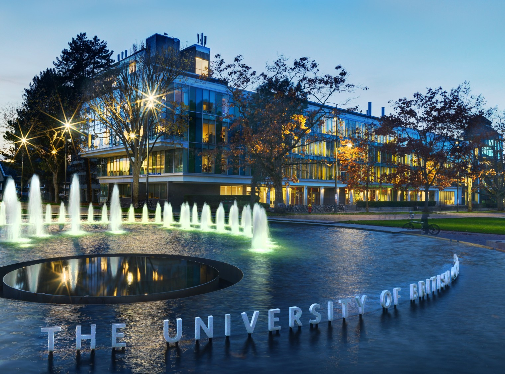
>[Sauder Business School](https://www.sauder.ubc.ca/news/school-news/ubc-ranked-1-canada-business-administration-arwu-fifth-consecutive-year)
 
Most of our classes are held in the Henry Angus Bldg. On the north side of the first floor, there is the meeting rooms area, you need to swipe your student ID card to enter, and you also need to make a reservation in advance. The north side of the second floor is the library. The lounge for MBAN is on the 3rd floor, and for MBA is the 4th floor.
 
### • UBC Bookstore

Located on the east side of Sauder, about 1 minute away. There are a variety of UBC souvenirs inside, such as mugs, books, etc. The most sought-after items are the co-branded culture shirts between UBC and Lululemon.

>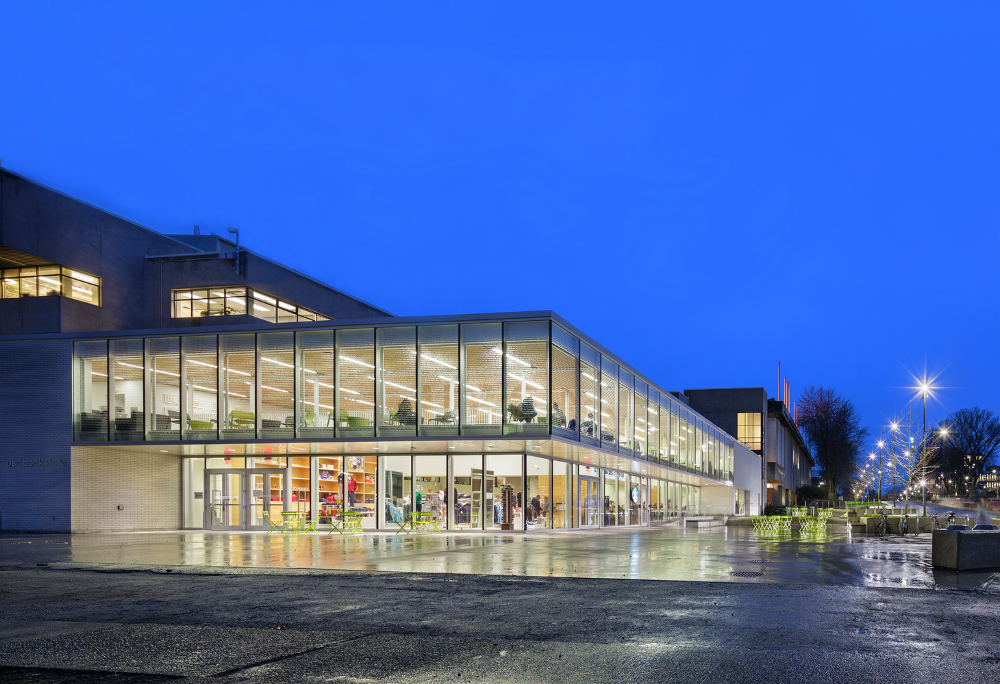
>[UBC Bookstore](https://www.archdaily.com/775763/ubc-bookstore-office-of-mcfarlane-biggar-architects-plus-designers/56278cd6e58ece127a000225-ubc-bookstore-office-of-mcfarlane-biggar-architects-plus-designers-photo?next_project=no)
 
### • Libraries

There are two libraries near Sauder, both are good place for self-study. Some movies are shoot here.

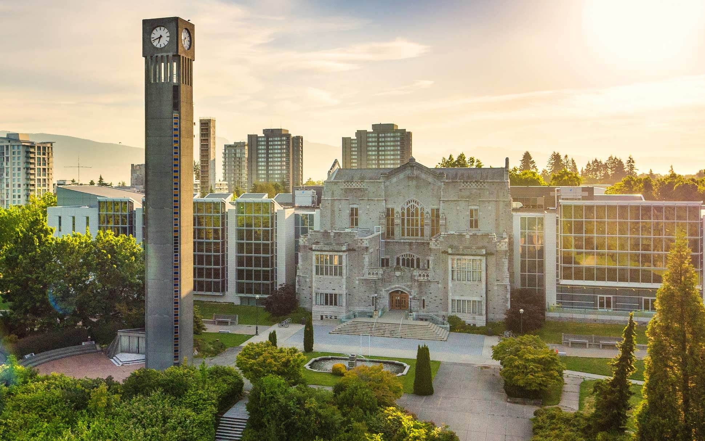
[Irving K. Barber Learning Centre](https://visit.ubc.ca/see-and-do/museums-and-art-galleries/irving-k-barber-learning-centre/)
 
Walter C. Koerner Library: 1958 Main Mall, Vancouver, BC V6T 1Z2
Irving K. Barber Learning Centre: 1961 E Mall, Vancouver, BC V6T 1Z1
 
### • Rose Garden

It is UBC's most famous landmark, and is 3 minutes north of Sauder, under the Canadian flag. This is the place where you can see both the ocean and the snow-capped mountains. It's small, but exquisite.
 
### • Wrech beach

Further north of the Rose Garden, a path leads to the beach. The scenery is beautiful, but Caution! This beach is a nude beach. You know, Canada is an extremely multicultural country, so please respect the choices of different people. While it's not mandatory for everyone entering the beach to be nude, you'll be embarrassed to be yourself when you realize you're the only one on the beach with clothes on, don't ask me how I know. I wish someone told me this the first day I arrived at UBC.
 
## ► School Life

### • Coffee Chat with BCC

It's never too early to start planning your new career. The good news is that we receive full support from the BCC (Business Career Centre). You can bring your resume and your aspirations to them, and you will receive a professional and warm response.

If you could only bookmark one site in your browser, I'd recommend reserving that spot for COOL (Career Options On-Line), managed by the BCC. You can use COOL to:

>* Book one-on-one career advising and coaching appointments.
>* Register for career-related workshops and employer events.
>* View and apply for job postings, volunteer, and skills development opportunities specifically targeted to UBC Sauder students.
>* View employer profiles - our Business Development team has direct connections to companies listed on COOL.
>* Access resources like CaseCoach, LinkedIn Masterclass, Firsthand, and more!

> **Link**: [Access COOL](https://sauder-ubc-csm.symplicity.com/)

### • Meeting Room Reservation

If you're just studying alone, just find a random library, but if you're working in a group and need to discuss with your team, you need to find a meeting room.
 
>**Link:** [Meeting room reservation](https://booking.sauder.ubc.ca/gbr/)
 
### • Printing/Scanning

There are printers in the library, you need to upload the documents you want to print to the website in advance and then swipe your student ID card in front of the printer to print. Remember to save some money on your student ID card first.
 
>**Link:** [Online printing website](https://payforprint.ubc.ca/user)
 
### • Certificate of enrollment

Sometimes, a certificate of enrollment is required to process some documents. You can do this on your own. Login to SSC (Student Service Centre), go to【Grades & Records】-【Proof of Enrollment Letter】
 
>**Link:** [Student Service Centre Website](https://ssc.adm.ubc.ca/sscportal/servlets/SRVSSCFramework)
 
### • Swimming Pool

As one of the benefits for UBC students, we can use the school's swimming pool for free. The UBC Aquatic Centre is a water center built to world-class standards. You only need to make a reservation one day in advance.
 
>Location: 6080 Student Union Blvd, Vancouver, BC V6T 1Z1

>**Link:** [Reservation address](https://recreation.ubc.ca/)
 
 
### • Ice skating:

As with the swimming pool, we can use the ice-skating rink for free. However, if you don't have your own helmet and skates, you must pay to rent them.
 
>**Link:** [Reservation address](https://recreation.ubc.ca/)
 
### • Golf Course

The closest golf course to UBC is right next, and although it's called the University Golf Club, it's not related to UBC in any way, so you can't use it for free. Having said that, it is really not expensive. For example, it costs only 5 dollars for 30 balls of golf practice, and you can get a discount on top-ups with your student ID.
 
>**Link:** [Universitygolf Website](https://universitygolf.com/)
 
## ► Restaurants

No one restaurant suits everyone's tastes so that I won't make any recommendations for restaurants, but there are a few tucked-away options to talk about.
 
### • Pizza

Pizza is always the least bad option, and there are a number of pizzerias on campus. The closest one to Sauder, and the cheapest, is Uncle Fatih's Pizza, which is $4 for a slice and $8 for a combo.
 
Location: 6045 University Blvd, Vancouver, BC V6T 0C5
 
### • Chinese restaurants

Food Court is highly recommended; there are several restaurants inside, almost the most cost-effective Chinese food on campus. It's about $12 for a set meal. It's located in the basement next to McDonald's, you need to go downstairs, and it's not very easy to find.
 
Location: 5726 University Blvd, Vancouver, BC V6T 1K6
 
### • Tim Hortons

Forget Starbucks; that's Seattle coffee. Here in Canada, we drink Tims, which can be found almost everywhere on the streets of Canada, and the most classic coffee is the “Double Double”. there is a Tims right next door to Sauder's, and many students will buy a cup of coffee there if they have a class in the morning, but it usually takes quite a long time to queue up.
 
## Medical

I don't expect you to use this knowledge, but if you need to, I hope you won't be in a hurry. This section does not constitute medical advice. Please consult a professional when needed.
 
Healthcare in Canada is a difficult topic to talk about. On the one hand, because of the excellent social welfare system, it's unlikely that you can't afford medical treatment if you have life-threatening issues. But on the other hand, the limited resources and efficiency makes the long wait a necessary part of the process.
 
### • Emergency

The good news is that if it's a life-threatening medical issue, you'll be the first to receive treatment if you call 911 or go to the emergency room, which is located on campus at UBC Hospital. The bad news is that most of the time, while we feel our illness is urgent, doctors usually don't feel that way. What often happens is that you go to the emergency room and wait for hours to see a doctor. On the bright side, this means your situation isn't all that worth worrying about.
 
UBC Hosptial: Koerner Pavilion, 2211 Wesbrook Mall UBC Hospital, Vancouver, BC V6T 2B5
 
### • Pharmacies

While there can be a wait of hours for an emergency room and weeks for a doctor's appointment, it is really easy to buy medication, and by that, I mean OTC (over-the-counter) medication. There are pharmacies all over Vancouver, in almost every supermarket. The most common is Shoppers; there is one right next to the UBC sign. You can buy OTC directly or consult a pharmacist.
 
### • Vaccines

Although the pandemic is almost over, the BC government still recommends COVID-19 vaccinations. It is free. Appointment times can be scheduled on the website or by calling to make a vaccine appointment. Vaccines are available in Shoppers.
 
In addition, our insurance covers vaccine expenses, and it is possible to get the other vaccine at a very low price: for example, HPV (it is for both men and women).
 
>**Link:** [Get Vaccinated Website](https://www2.gov.bc.ca/gov/content/covid-19/vaccine/register)
 
## ► Benefits

Being a student at UBC comes with many benefits. Some of them have already been listed, so I'll summarize them:
 
* public transportation: UPASS
 
* Free Amazon Primary membership for 6 months
 
* Free OneDrive account
 
* Free use of swimming pool/skating rink
 
* Insurance covers some of the cost of vaccine (HPV) 

* to be continued...
 

## ► Author Info

This article is originally written by Henry Wu, translated by DeepL, polished by ChatGPT, proofread by Grammarly, and finally edited by Henry Wu.

## ► Contents

- [ 100 Things I Wish I'd Known in My First 10 Days in Vancouver](#-100-things-i-wish-id-known-in-my-first-10-days-in-vancouver)
  - 
  - [► First Things First](#-first-things-first)
    - [• Study Permit](#-study-permit)
    - [• Work Permit](#-work-permit)
    - [• MSP](#-msp)
  - [► Baggage](#-baggage)
    - [• Suits](#-suits)
    - [• Bed sheets](#-bed-sheets)
    - [• Prohibited goods](#-prohibited-goods)
  - [► Phone Cards](#-phone-cards)
  - [► Bank Cards](#-bank-cards)
  - [► Shopping](#-shopping)
    - [• Supermarkets](#-supermarkets)
    - [• Online shopping](#-online-shopping)
    - [• One-Dollar store](#-one-dollar-store)
    - [• Second-hand](#-second-hand)
  - [► Getting Around](#-getting-around)
    - [• Public Transportation](#-public-transportation)
    - [• UPASS](#-upass)
    - [• Uber](#-uber)
    - [• Rent a car](#-rent-a-car)
  - [▶ Identifications](#-identifications)
    - [• Student card](#-student-card)
    - [• Student Email](#-student-email)
    - [• BCID](#-bcid)
    - [• Driver's License](#-drivers-license)
    - [• SIN](#-sin)
  - [► Campus](#-campus)
    - [• Sauder Business School](#-sauder-business-school)
    - [• UBC Bookstore](#-ubc-bookstore)
    - [• Libraries](#-libraries)
    - [• Rose Garden](#-rose-garden)
    - [• Wrech beach](#-wrech-beach)
  - [► School Life](#-school-life)
    - [• Coffee Chat with BCC](#-coffee-chat-with-bcc)
    - [• Meeting Room Reservation](#-meeting-room-reservation)
    - [• Printing/Scanning](#-printingscanning)
    - [• Certificate of enrollment](#-certificate-of-enrollment)
    - [• Swimming Pool](#-swimming-pool)
    - [• Ice skating:](#-ice-skating)
    - [• Golf Course](#-golf-course)
  - [► Restaurants](#-restaurants)
    - [• Pizza](#-pizza)
    - [• Chinese restaurants](#-chinese-restaurants)
    - [• Tim Hortons](#-tim-hortons)
  - [Medical](#medical)
    - [• Emergency](#-emergency)
    - [• Pharmacies](#-pharmacies)
    - [• Vaccines](#-vaccines)
  - [► Benefits](#-benefits)
  - [► Author Info](#-author-info)
  - [► Contents](#-contents)
  - [► Tips for Chinese Students](#-tips-for-chinese-students)
    - [• 银行卡](#-银行卡)
    - [• 电话卡](#-电话卡)
    - [• 大统华](#-大统华)
    - [• 亚洲超市](#-亚洲超市)
    - [• 列治文](#-列治文)
    - [• 海底捞](#-海底捞)
    - [• 支付宝](#-支付宝)

## ► Tips for Chinese Students

温哥华是北美华人生活舒适度最高的城市之一，除了贵和不好找工作外，几乎没有其他缺点。如果你是刚到温哥华的中国学生，这里有一些tips。

### • 银行卡

温哥华有两家中国银行，一家在Richmond，一家在Downtown。可以办理BOC Canada的卡，从国内的BOC转账不需要手续费，推荐办理。此外，其定期储蓄的利息比较高。

### • 电话卡

中国电信在加拿大也有分店，它们家的套餐性价比不是最高的，每月月租45刀左右，如果与国内通话不是刚需，建议选择性价比更高的本地电话卡。但如果有与国内打电话的刚需，它们家几乎是唯一的选择。

与国内通话包括两种情况：你拨打国内电话，或者让国内的人通过打电话找到你。这张卡还是双卡合一，也就是一张SIM卡上既有加拿大本地的号码，也有一个中国号码，这样你不用准备两个手机。你甚至可以在国内的时候就办理这张卡，这样在加拿大一落地就可以使用。使用推荐码(MMIXV)注册，会有10刀优惠。

有传闻说，加拿大将会不允许中国电信继续运营。不过在加拿大携号码转套餐很容易，如果真到了那一天，再转其他运营商即可。

### • 大统华

大统华YYDS，让你有一秒回国的感觉。超市里应有尽有，从老干妈到辣条，只有你想不到没有他办不到。强烈推荐你找时间去一趟，高低能缓解下思乡之愁。大统华在温哥华有不少店面，Richmond的这家比较大。更好的是，这家步行范围内就有一家ICBC和Canada Service Center，也就是说办BCID和SIN卡可以一起搞定。此外，大统华还提供外卖服务。

### • 亚洲超市

如果觉得大统华太远的话，在学校里就有两家亚洲超市。都在麦当劳附近。

**H-Mart Express**：University Blvd #103, Vancouver, BC V6T 1K6

**Chit Chat Enterprise**：5767 Dalhousie Rd, Vancouver, BC V6T 2H9

### • 列治文

温哥华没有唐人街，因为区区一条街哪够中国人住。温哥华华人密度最大的区域在Richmond，几乎可以不用说英文也能享受各种便利的服务。中餐厅很多，路上还能偶尔邂逅一些明星。

### • 海底捞

距离UBC不远就有一家海底捞，凭借学生证可以享受优惠。几乎能享受到与国内同品质的服务，而且价格也并没有贵很多。

**地址**：3204 W Broadway, Vancouver, BC V6K 2H4

### • 支付宝

温哥华有很多超市和餐厅是接受支付宝付款的。他乡遇故“支”。在Richmond的Costco旁的丰泰超市甚至还有家支付宝旗舰店。此外，缴纳学费不受到每年5万刀的外汇管制限制，也能通过支付宝缴纳。
